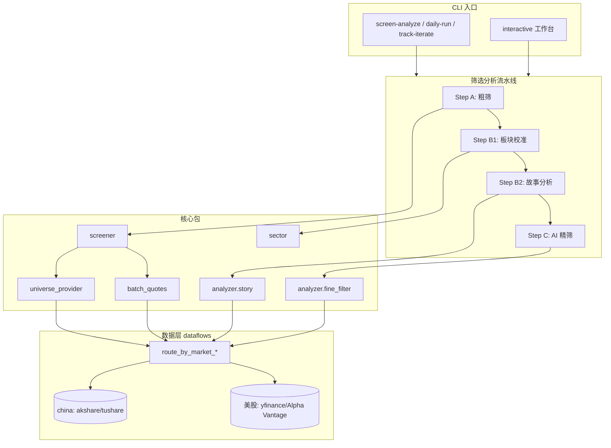
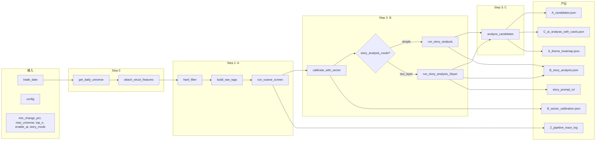
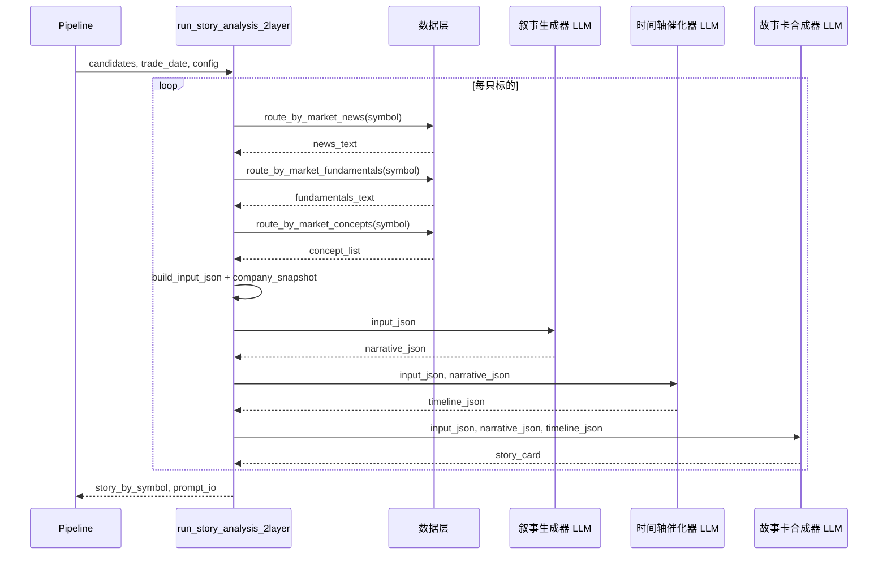
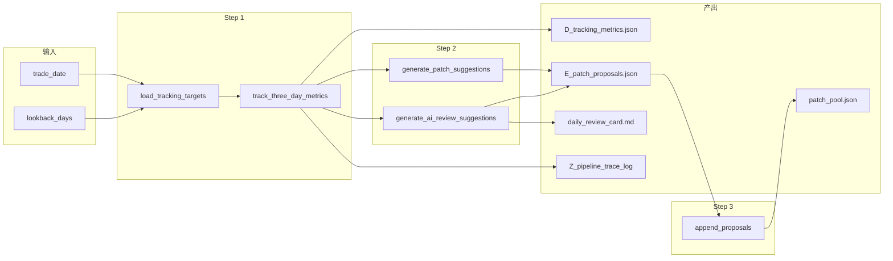

# 股票分析系统设计文档

本文档说明 A 股股票分析流水线中各模块的职责、输入输出及字段含义，并包含架构图、流程图与时序图。

---

## 一、图示

### 1.1 系统架构图

### 1.2 筛选分析流水线流程图

### 1.3 两层故事分析时序图

### 1.4 迭代流水线流程图

---

## 二、数据层（dataflows）

### 2.1 路由接口（interface.py）输入输出表

| 函数 | 输入参数 | 参数说明 | 输出类型 | 输出说明 |
|------|----------|----------|----------|----------|
| route_by_market_stock_data | symbol | 6 位代码 | str | CSV，列：Date, Open, High, Low, Close, Volume, Change%, Turnover% 等 |
| | start_date, end_date | YYYY-MM-DD | | |
| route_by_market_fundamentals | ticker | 代码 | str | Markdown 列表，每行 `- **键**: 值`（如 最新、股票代码、行业、总市值 等） |
| | curr_date | 可选，当前日期 | | |
| route_by_market_news | ticker | 代码 | str | 文本，含标题、来源、时间、内容摘要（按日期过滤） |
| | start_date, end_date | YYYY-MM-DD | | |
| route_by_market_concepts | ticker | 代码 | list[str] | 该股所属东财概念板块名称列表，如 `['机器人概念','人形机器人']` |
| | concept_keywords | 可选，筛选概念名的关键词 | | |
| route_by_market_global_news | curr_date, look_back_days, limit | 日期、回看天数、条数 | str | 宏观/要闻摘要 |

### 2.2 get_daily_universe 输入输出表

| 类别 | 字段/参数 | 类型 | 含义 |
|------|-----------|------|------|
| **输入参数** | trade_date | str | 交易日 YYYY-MM-DD |
| | min_change_pct | float | 最低涨幅阈值（%） |
| | main_board_only | bool | 是否仅主板（排除创业板/科创板/北交所） |
| | non_st_only | bool | 是否排除 ST |
| | max_items | int, optional | 最大返回条数，None 表示不截断 |
| **输出单条 (UniverseRecord)** | symbol | str | 6 位代码 |
| | ts_code | str | 如 000001.SZ |
| | name | str | 股票名称 |
| | market | str | 市场/板块描述 |
| | industry | str | 行业 |
| | is_st | bool | 是否 ST |
| | change_pct | float | 当日涨跌幅（%） |
| | close, open, high, low | float | 今收/今开/最高/最低 |
| | volume | float | 成交量 |
| | amount | float | 成交额 |

### 2.3 attach_struct_features 在每条记录上增加的字段

| 字段 | 类型 | 含义 |
|------|------|------|
| trend_label | str | 如 "uptrend" |
| recent_3d_change | float | 近 3 日涨跌幅（%） |
| last_close | float | 最近收盘价 |
| ma5, ma10, ma20 | float | 5/10/20 日均线 |
| vol_ratio | float | 量比 |
| position_score | float | 位置得分（规则用） |
| trend_score | float | 趋势得分 |
| volume_score | float | 量能得分 |
| breakout_score | float | 突破得分 |
| style_score | float | 风格得分 |

---

## 三、粗筛（screener）

### 3.1 rulebook 结构表

| 键 | 子键/元素 | 类型 | 含义 |
|------|-----------|------|------|
| weights | position_score | float | 权重系数 |
| | trend_score | float | |
| | volume_score | float | |
| | breakout_score | float | |
| | style_score | float | |
| | concept_score | float | |
| hard_filters | min_change_pct | float | 最低涨幅（%） |
| | exclude_st | bool | 是否排除 ST |
| | main_board_only | bool | 是否仅主板 |

### 3.2 run_coarse_screen 输入输出表

| 类别 | 字段/参数 | 类型 | 含义 |
|------|-----------|------|------|
| **输入** | records | List[Dict] | 带结构特征的候选列表（见 2.3） |
| | top_n | int | 兼容参数（当前实现不截断） |
| | rulebook | Dict | 规则表，见 3.1 |
| **输出 CoarseResult** | candidates | List[Dict] | 通过硬过滤的列表，每条在原基础上增加 coarse_reason_tags |
| | dropped | List[Dict] | 被剔除的列表，每条增加 drop_reasons |
| **candidates 每条新增** | coarse_reason_tags | List[str] | 如 ["breakout","trend_aligned","high_position","concept_present"] 或 ["basic_structure"] |
| **dropped 每条新增** | drop_reasons | List[str] | 如 ["change_pct_below_threshold"], ["st_excluded"], ["not_main_board"] |

---

## 四、板块校准（sector）

### 4.1 calibrate_with_sector 输入输出表

| 类别 | 字段/参数 | 类型 | 含义 |
|------|-----------|------|------|
| **输入** | analysis_list | List[Dict] | 待校准列表（通常为粗筛 candidates） |
| | all_candidates | List[Dict] | 用于统计板块的全体候选 |
| **输出** | sector_stats | Dict[str, Dict] | 键=行业名，值见下表 |
| | calibrated_analysis_list | List[Dict] | 每条=原条+板块相关字段（见下表） |

**sector_stats[sector] 字段表**

| 字段 | 类型 | 含义 |
|------|------|------|
| day_strength | float | 该行业当日平均涨幅（%） |
| trend_3d | float | 该行业 3 日平均涨幅（%） |
| momentum_factor | float | 动量因子，用于计算乘数 |
| leader_symbol | str | 板块内涨幅最大标的代码 |
| leader_change_pct | float | 龙头当日涨幅（%） |
| leader_recent_3d_change | float | 龙头 3 日涨幅（%） |
| leader_status | str | "强" / "分歧" / "退潮" |

**calibrated_analysis_list 每条新增字段**

| 字段 | 类型 | 含义 |
|------|------|------|
| sector | str | 行业 |
| sector_day_strength | float | 同 sector_stats |
| sector_trend_3d | float | 同 sector_stats |
| sector_leader_symbol | str | 同 sector_stats |
| sector_leader_status | str | 同 sector_stats |
| sector_multiplier | float | 0.85~1.15，用于后续评估 |
| calibration_reason | str | 如 "板块走强，上调评估" |

---

## 五、故事分析（analyzer）

### 5.1 简单模式 run_story_analysis

| 类别 | 字段/参数 | 类型 | 含义 |
|------|-----------|------|------|
| **输入** | candidates | List[Dict] | 粗筛后候选 |
| | trade_date | str | 交易日 |
| | news_max_chars | int | 新闻文本最大字符数 |
| **输出** | trade_date | str | 同输入 |
| | count | int | story_by_symbol 的数量 |
| | story_by_symbol | Dict[str, Dict] | 键=symbol，值见下表 |
| **story_by_symbol[symbol]** | story_payload | Dict | 见下表 |
| | news_text | str | 近 7 日新闻摘要原文 |

**story_payload（简单模式）字段表**

| 字段 | 类型 | 含义 |
|------|------|------|
| news_count | int | 新闻条数（按 ### 分割） |
| keyword_hits | Dict[str, int] | 关键词出现次数（涨停、龙虎榜、题材、政策等） |
| story_heat_level | str | "high" / "medium" / "low" |
| is_mainline_candidate | bool | 是否含主线/龙头关键词 |
| has_risk_alert | bool | 是否含风险提示关键词 |
| raw_length | int | 新闻文本长度 |

### 5.2 两层模式：build_input_json（三层 LLM 共用输入）

| 字段 | 类型 | 含义 |
|------|------|------|
| symbol | str | 股票代码 |
| name | str | 股票名称 |
| industry | str | 行业 |
| change_pct | float | 当日涨跌幅 |
| recent_3d_change | float | 近 3 日涨跌幅 |
| company_snapshot | Dict | 见下表 |
| evidence_list | List[Dict] | 见下表 |
| concept_list | List[str] | 东财概念名列表 |

**company_snapshot 字段表**

| 字段 | 类型 | 含义 |
|------|------|------|
| company_intro | str | 一句话介绍（含行业、主营摘要） |
| main_business_axes | List[str] | 主营方向列表（从主营文本拆分） |
| main_business_raw | str | 主营业务/经营范围原文（截断） |
| fundamentals_excerpt | str | 基本面文本摘要（来自 get_fundamentals） |

**evidence_list 单条字段表**

| 字段 | 类型 | 含义 |
|------|------|------|
| id | str | 如 "E1", "E2" |
| title | str | 新闻标题或首行 |
| snippet | str | 正文片段（约 500 字） |

### 5.3 叙事假设生成器：输入 / 输出 / Prompt

**输入**：仅 `input_json`（即 build_input_json 的返回值）。

**输出 narrative_json 字段表**

| 字段 | 类型 | 含义 |
|------|------|------|
| company_profile | Dict | 见下表 |
| market_narrative | List[Dict] | 见下表 |
| company_direction | List[Dict] | 见下表 |
| evidence_hardness | Dict | 见下表 |
| data_gaps | List[str] | 信息缺口说明 |
| main_narrative_A | str | 主故事 A：新方向/募投（丝杠、机器人轴承等） |
| main_narrative_B | str | 主故事 B：传统业务背书 |

**company_profile**

| 字段 | 类型 | 含义 |
|------|------|------|
| company_intro | str | 公司介绍（100 字内） |
| main_business_axes | List[str] | 主营方向 |
| legacy_to_new_bridge | str | 传统业务如何给新方向背书 |
| type | str | "HARD" \| "INFERRED" |
| evidence_ids | List[str] | 引用的证据 id，如 ["E2"] |

**market_narrative 单条**

| 字段 | 类型 | 含义 |
|------|------|------|
| narrative | str | 市场复读的主叙事 |
| type | str | "HARD" \| "INFERRED" |
| basis | str | 推断依据（概念、rank_5d、ret_5d） |

**company_direction 单条**

| 字段 | 类型 | 含义 |
|------|------|------|
| direction | str | 公司在做的方向描述 |
| type | str | "HARD" \| "INFERRED" |
| evidence_ids 或 basis | - | HARD 用 evidence_ids，INFERRED 用 basis |

**evidence_hardness**

| 字段 | 类型 | 含义 |
|------|------|------|
| hard_docs | List[str] | 硬证据 id 列表 |
| risk_docs | List[str] | 风险相关证据 id |
| hardness_grade | str | "Strong" \| "Medium" \| "Weak" |
| reason | str | 为何硬/为何弱（≤100 字） |

**Prompt（叙事假设生成器）**

- **System**：角色为 A 股「叙事假设生成器」；规则包括：HARD/INFERRED 区分、必须引用 evidence_ids 或写 basis、禁止编造细节、有 concept_list 时必须输出对应市场叙事并在缺证据时写 data_gaps、输出严格 JSON。
- **User**：占位 `{input_json}` 替换为上述 input_json 的 JSON 字符串；并附说明 concept_list 含义及 data_gaps 填写要求；输出格式为带 company_profile、market_narrative、company_direction、evidence_hardness、data_gaps、main_narrative_A、main_narrative_B 的 JSON。
- 完整内容见代码：`tradingagents/analyzer/story_two_layer.py` 中 `NARRATIVE_SYSTEM`、`NARRATIVE_USER`。

### 5.4 时间轴与催化器：输入 / 输出 / Prompt

**输入**：`input_json`（同上）、`narrative_json`（上一节输出）。

**输出 timeline_json 字段表**

| 字段 | 类型 | 含义 |
|------|------|------|
| timeline_1_3m | List[Dict] | 近 1–3 个月催化事件，每条见下表 |
| catalyst_quality | Dict | 见下表 |
| unverifiable_note | str | 可选，暂无可验证催化说明 |

**timeline_1_3m 单条**

| 字段 | 类型 | 含义 |
|------|------|------|
| event | str | 事件描述 |
| type | str | "HARD" \| "INFERRED" |
| window | str | 如 "1-3个月" |
| evidence_ids | List[str] | 证据 id |
| basis | str | 推断依据 |

**catalyst_quality**

| 字段 | 类型 | 含义 |
|------|------|------|
| near_term_grade | str | "Strong" \| "Medium" \| "Weak" |
| mid_term_grade | str | 同上 |
| data_gaps | List[str] | 数据/催化缺口 |

**Prompt（时间轴与催化器）**

- **System**：角色为「时间轴与催化器」；每条催化标 HARD/INFERRED；证据不足时输出暂无可验证催化并说明缺口；输出严格 JSON。
- **User**：占位 `{input_json}`、`{narrative_json}` 替换为对应 JSON；输出格式为 timeline_1_3m + catalyst_quality。
- 完整内容见代码：`TIMELINE_SYSTEM`、`TIMELINE_USER`。

### 5.5 故事卡合成器：输入 / 输出 / Prompt

**输入**：`input_json`、`narrative_json`、`timeline_json`。

**输出 story_card 字段表**

| 字段 | 类型 | 含义 |
|------|------|------|
| market_impression | str | 市场中的一句话印象（100 字内） |
| one_liner | str | 一句话总结 |
| company_basics | Dict | company_intro, main_business_axes, legacy_to_new_bridge |
| story | Dict | market_repeated_narrative, company_direction, so_what |
| highlights | List[Dict] | 每条：title, detail, type, evidence_ids, basis, impact |
| drawbacks | List[Dict] | 每条：title, detail, type, evidence_ids, basis, risk_level |
| evidence_assessment | Dict | hardness_grade, hard_evidence, weak_points |
| timeline | Dict | near_1_3m, mid_1_3y |
| why_money_comes | List[Dict] | reason, type, basis_or_numbers |
| downgrade_rules | List[Dict] | signal, action, trigger, evidence_ids |
| evidence_list | List | 证据列表（可空） |
| notes | Dict | data_gaps, strictness |
| main_story_A | str | 主故事 A 文案 |
| main_story_B | str | 主故事 B 文案 |

**Prompt（故事卡合成器）**

- **System**：角色为「故事性雷达合成器」；目标为 5 个问题（故事是什么、证据是否够硬、催化时间表、资金为何来、反证条件）；规则包括 HARD/INFERRED、concept 有但证据无时必填 data_gaps 与主线表述、兼有传统与机器人/丝杠时必填 main_story_A/B、输出严格 JSON。
- **User**：占位 `{input_json}`、`{narrative_json}`、`{timeline_json}`；输出为上述 story_card 的完整 JSON schema，并附带条数要求（highlights≥3、drawbacks≥3、why_money_comes≥3、downgrade_rules≥4 等）。
- 完整内容见代码：`SYNTHESIZER_SYSTEM`、`SYNTHESIZER_USER`。

### 5.6 两层模式 story_by_symbol[symbol] 总表

| 字段 | 类型 | 含义 |
|------|------|------|
| company_snapshot | Dict | 本层构建，见 5.2 company_snapshot |
| narrative_json | Dict | 见 5.3 |
| timeline_json | Dict | 见 5.4 |
| story_card | Dict | 见 5.5 |
| story_payload | Dict | 供 C 阶段用：news_count, story_heat_level, is_mainline_candidate, has_risk_alert, one_liner, raw_length 等 |
| prompt_io | Dict | narrative_generator / timeline_catalyst / story_synthesizer 的 raw_input、raw_output、parsed、prompt_text |

---

## 六、精筛与决策卡（analyzer.fine_filter_engine）

### 6.1 analyze_candidates 输入输出表

| 类别 | 字段/参数 | 类型 | 含义 |
|------|-----------|------|------|
| **输入** | candidates | List[Dict] | 粗筛+板块校准后的列表 |
| | trade_date | str | 交易日 |
| | config | Dict | 含 stock_analysis.prompt_path、llm 等 |
| | max_selected | int | 兼容参数（当前不截断） |
| | enable_ai | bool | 是否调用 LLM，否则规则兜底 |
| | sector_context_by_symbol | Dict[str, Dict] | 每标的板块上下文 |
| | story_by_symbol | Dict[str, Dict] | 每标的故事数据（含 story_payload） |
| **输出** | analysis_list | List[Dict] | 与 decision_cards 一致，每条为 DecisionCard 序列化 |
| | decision_cards | List[Dict] | 同上 |
| | decision_card_5lines | Dict[str, str] | 键=symbol，值=5 行卡文案 |
| | analysis_trace | Dict[str, Dict] | 键=symbol，值={ mode: "ai"\|"fallback", error: str } |
| | info_gaps | List[Dict] | 每条 { symbol, gaps: List[str] } |

### 6.2 DecisionCard 字段表（精筛输出单条）

| 字段 | 类型 | 含义 |
|------|------|------|
| symbol | str | 股票代码 |
| name | str | 股票名称 |
| industry | str | 行业 |
| conclusion_type | str | "趋势" \| "情绪" \| "混合" |
| stage | str | "启动" \| "加速" \| "调整" \| "二次启动" |
| evidence_chain | List[str] | 证据链（至少一条含板块上下文） |
| tradability | str | 可交易性一句话 |
| sustainability | str | 可持续性一句话 |
| expectation_gap | str | 预期差一句话 |
| structure_position | str | 结构位置一句话 |
| max_risk | str | 最大风险一句话 |
| reversal_trigger | str | 反转触发条件一句话 |
| info_gaps | List[str] | 信息缺口列表 |

### 6.3 精筛 Prompt（C 阶段）

- **占位**：`{stock_payload}`、`{story_payload}`、`{sector_payload}`、`{news_payload}`。
- **stock_payload**：JSON，字段来自候选条目的 symbol, name, industry, market, change_pct, close, open, high, low, volume, amount, trend_label, recent_3d_change, last_close, ma5, ma10, ma20, vol_ratio 等。
- **sector_payload**：JSON，含 sector, sector_day_strength, sector_trend_3d, sector_multiplier, sector_leader_symbol, sector_leader_status, calibration_reason。
- **story_payload**：两层模式下来自 story_by_symbol[symbol].story_payload，否则由新闻关键词统计得到（见 5.1 story_payload）。
- **news_payload**：近 7 日新闻摘要原文。
- **要求**：evidence_chain 至少 1 条引用板块上下文；tradability/sustainability/max_risk 体现板块影响；只返回 JSON，无解释。
- **输出 JSON 结构**：与 DecisionCard 字段一致（conclusion_type, stage, evidence_chain, tradability, sustainability, expectation_gap, structure_position, max_risk, reversal_trigger, info_gaps）。
- 完整模板见代码：`tradingagents/analyzer/fine_filter_engine.py` 中 `PROMPT_TEMPLATE`；若配置了 `stock_analysis.prompt_path`，则从文件加载并在末尾追加上述占位与输出说明。

---

## 七、筛选分析流水线（pipelines）产出文件与字段

| 文件 | 顶层/主要字段 | 含义 |
|------|----------------|------|
| A_candidates.json | trade_date | 交易日 |
| | count | 候选数量 |
| | candidates | 列表，每条含 2.2+2.3+3.2 的字段及 coarse_reason_tags |
| B_sector_calibration.json | trade_date | 交易日 |
| | sector_stats | 见 4.1 sector_stats |
| | calibrated_analysis_list | 见 4.1 calibrated 每条 |
| B_story_analysis.json | trade_date, count, mode | mode 为 "simple" 或 "two_layer" |
| | story_by_symbol | 见 5.1（simple）或 5.6（two_layer） |
| story_prompt_io/\<symbol\>/ | 1_narrative_input.txt | 叙事生成器完整 prompt（含 input_json） |
| | 1_narrative_output.txt | 叙事生成器原始 LLM 输出 |
| | 2_timeline_input.txt | 时间轴 prompt |
| | 2_timeline_output.txt | 时间轴原始输出 |
| | 3_synthesizer_input.txt | 合成器 prompt |
| | 3_synthesizer_output.txt | 合成器原始输出 |
| C_ai_analysis_with_cards.json | analysis_list | 见 6.2 |
| | decision_cards | 同上 |
| | decision_card_5lines | 见 6.1 |
| | analysis_trace | 见 6.1 |
| | info_gaps | 见 6.1 |
| S_theme_heatmap.json | top_sectors | [{ sector, count, avg_change_pct }] |
| | story_tag_stats | { risk_alert, theme_hot, breakout } 计数 |
| Z_pipeline_trace_log.json | step_0_goals_and_boundaries | 输入参数等 |
| | step_1_coarse_screen | 粗筛输入输出摘要 |
| | step_2_sector_calibration | 板块校准摘要 |
| | step_2_story_analysis | 故事分析摘要 |
| | step_3_fine_screen | 精筛摘要 |

---

## 八、迭代流水线（pipelines/iteration_pipeline）

### 8.1 load_tracking_targets 与 track_three_day_metrics

**tracking_metrics 单条字段表（D_tracking_metrics.json 中 tracking_metrics 元素）**

| 字段 | 类型 | 含义 |
|------|------|------|
| symbol | str | 股票代码 |
| name | str | 股票名称 |
| source_trade_date | str | 入选日（来源交易日） |
| source_close | float | 入选日收盘价 |
| t1_return_pct, t2_return_pct, t3_return_pct | float | T+1/T+2/T+3 收益率（%） |
| mdd_3d_pct | float | 3 日内最大回撤（%） |
| reason_t1, reason_t2, reason_t3 | str | 各日涨跌原因简述 |
| reason_tags_t1/t2/t3 | List[str] | 标签 |
| should_remove | bool | 是否建议从池中剔除 |
| remove_reason | str | 剔除原因 |
| decision_stage | str | 入选时阶段 |
| decision_conclusion_type | str | 入选时结论类型 |
| decision_evidence_chain | List[str] | 入选时证据链 |
| decision_info_gaps | List[str] | 入选时信息缺口 |

### 8.2 E_patch_proposals 与补丁建议单条

| 字段 | 类型 | 含义 |
|------|------|------|
| type | str | "rule" \| "prompt" |
| title | str | 建议标题 |
| suggestion | str | 具体建议文案 |
| evidence | Dict | 触发统计证据（如 avg_mdd_3d_pct, sample_size） |
| trigger_samples | List[Dict] | 触发样本（如 symbol, mdd_3d_pct） |
| confidence | float | 置信度 0–1 |
| status | str | "proposed" \| "accepted" \| "rejected" |

### 8.3 迭代产出文件

| 文件 | 主要字段 | 含义 |
|------|-----------|------|
| D_tracking_metrics.json | target_count, tracking_metrics | 见 8.1 |
| E_patch_proposals.json | rule_patch_suggestions | 见 8.2 |
| | prompt_patch_suggestions | 同上 |
| daily_review_card.md | - | 复盘卡片正文 |
| patch_pool.json | 列表，每项为 8.2 结构 + id 等 | 补丁候选池 |
| Z_pipeline_trace_log.json | step_1_tracking, step_2_review_suggestions, step_3_patch_pool | 各步输入输出摘要 |

---

## 九、配置与 CLI 入口

| 项目 | 说明 |
|------|------|
| 默认配置 | `tradingagents/default_config.py` 的 `DEFAULT_CONFIG`（project_dir, results_dir, llm_provider, quick_think_llm, market_type, stock_analysis 等） |
| 运行时读写 | `tradingagents.dataflows.config.get_config()` / `set_config()` |
| stock_analysis 常用键 | story_analysis_mode（"simple"\|"two_layer"）, enable_ai, prompt_path, min_change_pct, top_n_coarse, top_n_fine, max_universe, rulebook_path |
| CLI 子命令 | screen-analyze（--story-mode）, daily-run（--story-mode）, track-iterate, dashboard, patch-status, patch-apply, interactive |

以上为系统设计、输入输出字段表及所用 Prompt 的完整说明；所有 Prompt 全文以代码为准（`story_two_layer.py`、`fine_filter_engine.py`）。
