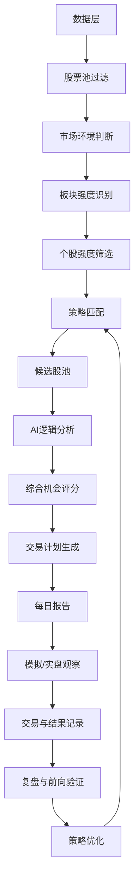
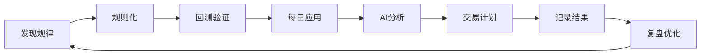
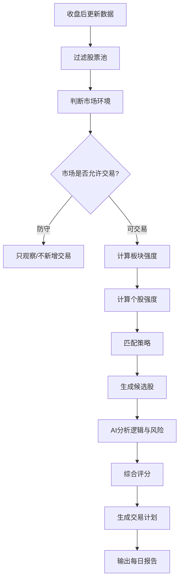
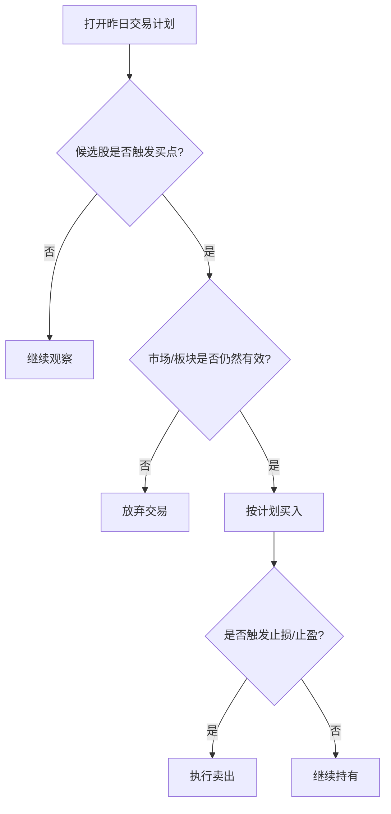
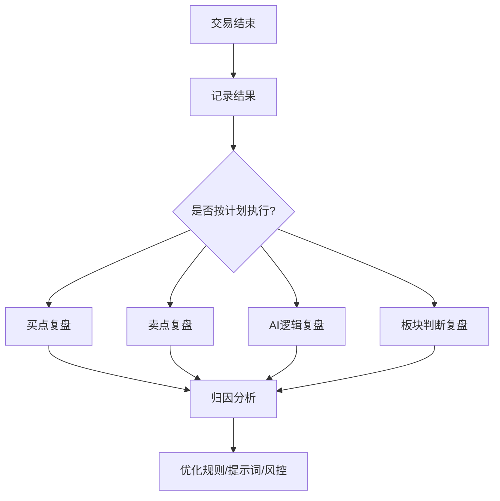
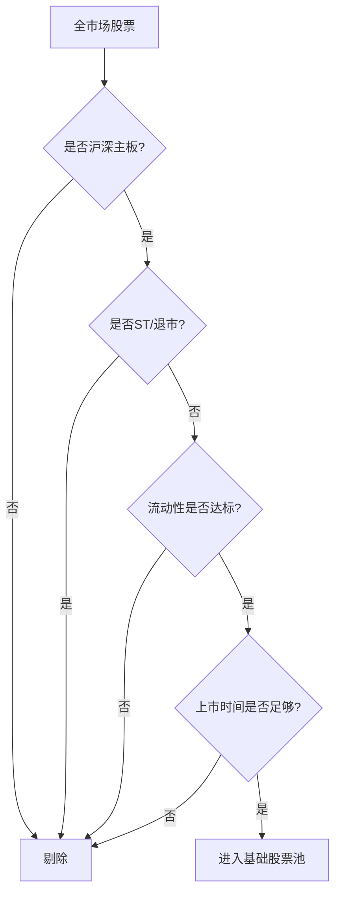
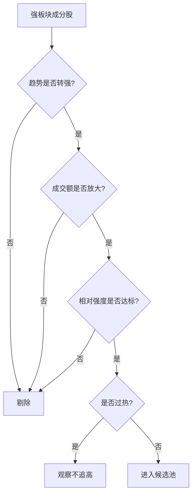
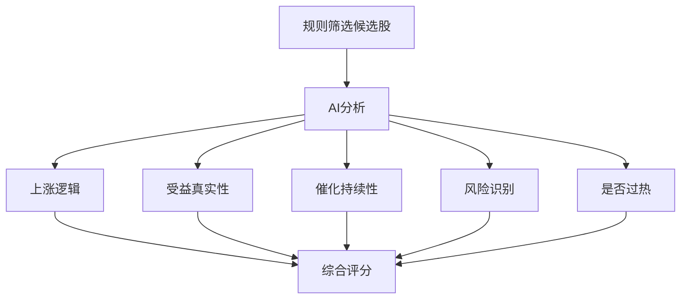
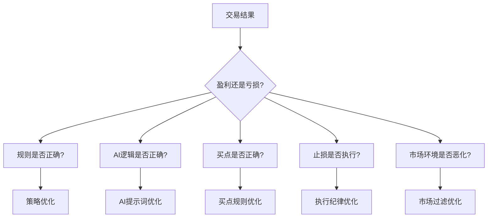
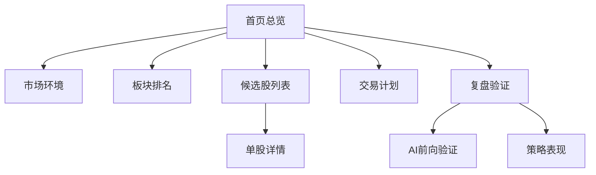

# AI 股票筛选系统 PRD V1.0

> 来源：飞书文档 `https://my.feishu.cn/docx/YhQDdEG4qoXgfDxOz2Uc2UImn2b`
>
> 文档版本：`revision_id=51`
>
> 沉淀日期：2026-05-11
>
> 说明：本文已将飞书文档中的内嵌电子表格展开为 Markdown 表格，便于在项目仓库中离线阅读、评审和版本管理。

## 1. 产品一句话

用硬数据筛选候选股，用 AI 验证上涨逻辑和风险，最终输出带买点、止损、仓位和失效条件的交易计划。

## 2. 产品核心理念

### 2.1 总原则

- 硬数据做核心
- AI 做增强
- 回测防过拟合
- 前向验证 AI
- 风控决定生死
- 复盘推动进化

### 2.2 系统分工

| 模块 | 核心职责 | 不能做什么 |
| --- | --- | --- |
| 规则系统 | 筛出候选股 | 不能凭故事选股 |
| AI 系统 | 解释逻辑、识别风险、辅助排序 | 不能直接决定买卖 |
| 回测系统 | 验证规则是否有效 | 不能证明未来一定赚钱 |
| 风控系统 | 限制亏损和仓位 | 不能被 AI 覆盖 |
| 复盘系统 | 验证系统判断是否有效 | 不能只看单次盈亏 |

## 3. 产品要解决的问题

本产品要解决的核心问题是：短线和波段投研过程中，用户每天面对大量股票、板块和信息源，容易出现候选发现低效、上涨逻辑不可验证、风险约束不足、复盘依赖主观印象的问题。

系统通过规则筛选、市场和板块判断、AI 逻辑分析、交易计划生成、复盘与前向验证，把“发现机会、解释机会、约束风险、记录结果、持续优化”串成闭环。

## 4. 产品目标

### 4.1 V1 目标

V1 的目标不是“预测涨停”，而是每天盘后稳定输出：

- 今天市场能不能做？
- 当前最强板块是什么？
- 哪些股票符合强势股模型？
- 这些股票为什么涨？
- 逻辑是真是假？
- 风险在哪里？
- 什么条件下可以买？
- 错了在哪里卖？
- 仓位应该多大？

## 5. 产品整体架构

### 5.1 总架构图



### 5.2 产品闭环



## 6. 核心使用流程

### 6.1 每日盘后流程



### 6.2 次日盘中流程



### 6.3 交易后复盘流程



## 7. 核心模块总览

| 模块 | 作用 | 主要输出 | 设计原因 |
| --- | --- | --- | --- |
| 股票池过滤 | 剔除不适合交易股票 | 可交易股票池 | 降低噪音和风险 |
| 市场环境判断 | 判断能否进攻 | 市场状态 | 避免弱市强行交易 |
| 板块强度识别 | 找资金主线 | 强板块排名 | 强势股通常来自强板块 |
| 个股强度筛选 | 找强板块内强股 | 候选个股 | 过滤跟风和弱股 |
| 策略匹配 | 判断符合哪种模型 | 命中策略 | 不同市场用不同策略 |
| AI 分析 | 验证逻辑和风险 | AI 结构化结论 | 提升研究效率 |
| 综合评分 | 对候选股排序 | S/A/B/C 等级 | 聚焦重点机会 |
| 交易计划 | 给出执行方案 | 买点、止损、仓位 | 避免只选股不控风险 |
| 复盘验证 | 评估系统效果 | 策略和 AI 表现 | 让系统持续进化 |

## 8. 核心模块设计

### 8.1 股票池过滤模块

#### 目标

从全市场中筛出基础可交易股票池。

#### 过滤逻辑



#### 主要规则

| 规则 | 处理 |
| --- | --- |
| 创业板、科创板、北交所 | 剔除 |
| ST、*ST、退市整理 | 剔除 |
| 上市时间太短 | 剔除 |
| 成交额过低 | 剔除 |
| 长期停牌 | 剔除 |

#### 设计原因

这一层不是为了赚钱，而是为了防止系统被低质量样本污染。

### 8.2 市场环境判断模块

#### 目标

判断今天适合进攻、轻仓、观察还是防守。

#### 市场状态分级

| 市场分 | 状态 | 系统行为 |
| --- | --- | --- |
| >= 75 | 攻击 | 可以正常寻找交易机会 |
| 60-74 | 正常 | 可以参与，但控制仓位 |
| 45-59 | 谨慎 | 只做高质量机会 |
| < 45 | 防守 | 不新增交易或只观察 |

#### 评分维度

| 维度 | 权重 | 说明 |
| --- | --- | --- |
| 指数趋势 | 30% | 主要指数是否站上关键均线 |
| 市场广度 | 20% | 上涨家数占比 |
| 成交额状态 | 20% | 全市场成交额是否放大 |
| 涨跌停情绪 | 20% | 涨停多还是跌停多 |
| 风险偏好 | 10% | 强势股反馈是否良好 |

#### 设计原因

同一个选股策略，在强市场和弱市场里的效果完全不同。所以系统必须先判断：现在适不适合做股票？

### 8.3 板块强度识别模块

#### 目标

识别资金正在攻击的主线板块。

#### 板块评分维度

| 维度 | 权重 | 说明 |
| --- | --- | --- |
| 短期涨幅 | 25% | 1/3/5 日涨幅 |
| 相对强度 | 20% | 是否跑赢大盘 |
| 成交额放大 | 20% | 是否有资金进入 |
| 板块宽度 | 15% | 板块内多少股票走强 |
| 涨停数量 | 10% | 情绪强度 |
| 持续性 | 10% | 是否连续多日强势 |

#### 板块状态

| 板块分 | 状态 |
| --- | --- |
| >= 80 | 强主线 |
| 70-79 | 强势板块 |
| 60-69 | 观察板块 |
| < 60 | 普通/弱板块 |

#### 设计原因

强势股往往不是孤立上涨，而是来自强板块。

系统优先寻找：强市场里的强板块，强板块里的强个股。

### 8.4 个股强度筛选模块

#### 目标

在强板块中筛出真正有资金介入的强势股。

#### 个股评分维度

| 维度 | 权重 | 说明 |
| --- | --- | --- |
| 趋势结构 | 25% | 是否站上 MA20/MA60 |
| 相对强度 | 20% | 是否强于指数和板块 |
| 成交额变化 | 20% | 是否温和放量 |
| 距离新高 | 15% | 是否接近阶段新高 |
| 回撤控制 | 10% | 是否没有大幅破位 |
| 流动性 | 10% | 是否便于买卖 |

#### 个股筛选逻辑



#### 设计原因

好股票不是越低越好，而是已经被资金关注、趋势刚开始转强、但还没有完全过热。

## 9. 策略体系设计

V1 不做一个万能策略，而是做多策略框架。

### 9.1 策略总览

| 策略 | 目标 | 适合市场 | V1优先级 |
| --- | --- | --- | --- |
| 主线趋势策略 | 抓强板块趋势股 | 结构性行情、震荡上行 | 高 |
| 商品价格驱动策略 | 抓涨价链机会 | 有色、煤炭、化工等周期行情 | 中 |
| 事件催化策略 | 抓公告、政策、订单机会 | 题材活跃阶段 | 中 |
| 业绩反转策略 | 抓业绩改善重估 | 财报季、价值修复 | 低 |
| 情绪强势策略 | 抓连板和短线龙头 | 短线情绪强 | 低 |

### 9.2 V1 主策略：主线趋势策略

#### 策略逻辑

```text
市场不弱
+ 板块强势
+ 个股趋势转强
+ 成交额放大
+ 相对大盘强
= 候选股
```

#### 适合捕捉

- 强板块趋势中军
- 主线波段股
- 放量突破股
- 回踩后二次启动股

#### 设计原因

这是最适合作为 V1 的策略，因为它数据容易获取、逻辑清晰、便于回测、不强依赖历史新闻、适合盘后筛选。

### 9.3 V1.5 策略：商品价格驱动策略

#### 策略逻辑

```text
商品价格上涨
+ 相关板块走强
+ 公司有真实商品暴露
+ 个股趋势转强
= 商品涨价链机会
```

#### 商品链路示意图


#### 设计原因

商品价格是连续、客观、可回测的数据，比历史新闻更可靠。该策略适合用于有色、煤炭、化工、能源等板块。

### 9.4 事件催化策略

#### 策略逻辑

```text
结构化正向事件
+ 个股量价转强
+ 板块不弱
+ AI 判断受益真实
= 事件催化候选股
```

#### 事件分类

| 事件类型 | 方向 | 处理方式 |
| --- | --- | --- |
| 业绩预增 | 正向 | 加分 |
| 重大合同 | 正向 | 加分 |
| 产品涨价 | 正向 | 加分 |
| 减持 | 负向 | 扣分 |
| 解禁 | 负向/中性 | 风险提示 |
| 监管问询 | 负向 | 扣分 |
| 业绩下滑 | 负向 | 剔除或降级 |

#### 设计原因

事件催化有价值，但历史新闻难以精准回测。所以 V1 只使用结构化事件，新闻分析主要交给 AI 做前向验证。

## 10. AI 分析设计

### 10.1 AI 在系统中的位置



### 10.2 AI 不直接选股的原因

| 风险 | 说明 | 产品处理 |
| --- | --- | --- |
| 事后解释 | AI 容易根据涨幅找理由 | 只分析候选股 |
| 幻觉 | AI 可能编造不存在的信息 | 输出必须结构化并标注证据 |
| 难回测 | 历史新闻难以还原 | AI 做前向验证 |
| 过度自信 | AI 可能给出确定性判断 | 不允许输出“必涨” |
| 忽视风控 | AI 偏重故事 | 风控模块独立存在 |

### 10.3 AI 分析输出

| 字段 | 说明 |
| --- | --- |
| 上涨原因 | 为什么进入候选池 |
| 催化类型 | 商品价格/政策/业绩/订单/资金博弈 |
| 受益真实性 | 公司是否真的受益 |
| 催化强度 | 逻辑强不强 |
| 持续性 | 是否可能持续 |
| 风险评分 | 是否有重大风险 |
| 过热评分 | 是否短期涨幅过大 |
| 板块地位 | 龙头/中军/补涨/跟风 |
| 结论 | 交易计划/观察/剔除 |

### 10.4 AI 输出示例

| 项目 | 示例 |
| --- | --- |
| 股票 | 示例股份 |
| 策略 | 商品价格驱动 |
| 上涨逻辑 | 铜价上涨，有色板块走强，公司存在铜业务暴露 |
| 受益真实性 | 4/5 |
| 催化强度 | 4/5 |
| 持续性 | 3/5 |
| 风险评分 | 2/5 |
| 过热评分 | 3/5 |
| 板块地位 | 趋势中军 |
| 结论 | A级观察，等待买点确认 |

## 11. 综合机会评分

### 11.1 评分模型

```text
最终机会分 =
市场环境 10%
+ 板块强度 20%
+ 个股强度 20%
+ 量价结构 15%
+ 策略匹配 10%
+ AI催化真实性 10%
+ 买点质量 10%
- 风险惩罚 15%
```

### 11.2 评分矩阵

| 维度 | 权重 | 来源 |
| --- | --- | --- |
| 市场环境 | 10% | 市场评分模块 |
| 板块强度 | 20% | 板块评分模块 |
| 个股强度 | 20% | 个股评分模块 |
| 量价结构 | 15% | 技术因子 |
| 策略匹配 | 10% | 策略库 |
| AI 催化真实性 | 10% | AI 分析 |
| 买点质量 | 10% | 交易计划模块 |
| 风险惩罚 | -15% | AI + 风控模块 |

### 11.3 等级定义

| 等级 | 分数 | 含义 | 动作 |
| --- | --- | --- | --- |
| S | >= 85 | 高质量机会 | 生成交易计划 |
| A | 75-84 | 重点观察 | 等待买点 |
| B | 65-74 | 普通观察 | 暂不交易 |
| C | < 65 | 低优先级 | 剔除 |

## 12. 交易计划设计

### 12.1 交易计划不是“买入建议”

系统最终不输出：

```text
买入 XX 股票
```

而是输出：

```text
在满足条件 A、B、C 后，可以考虑买入；
如果触发条件 X、Y、Z，则放弃或卖出。
```

### 12.2 交易计划字段

| 字段 | 说明 |
| --- | --- |
| 股票名称 | 候选股票 |
| 所属策略 | 主线趋势/商品价格/事件催化 |
| 机会等级 | S/A/B |
| 买入条件 | 触发后才考虑 |
| 止损条件 | 错了在哪里退出 |
| 止盈规则 | 如何保护利润 |
| 失效条件 | 逻辑不成立时如何处理 |
| 仓位建议 | 最大可买比例 |
| 持仓周期 | 预期持有时间 |
| 关注变量 | 板块、商品、公告、风险事件 |

### 12.3 买入条件类型

| 类型 | 适用场景 | 条件 |
| --- | --- | --- |
| 放量突破 | 主升启动 | 放量突破前高 |
| 回踩确认 | 不想追高 | 回踩 MA10/MA20 不破后转强 |
| 二次启动 | 第一波后横盘 | 缩量横盘后再次放量突破 |

### 12.4 止损条件类型

| 类型 | 示例 |
| --- | --- |
| 技术止损 | 跌破 MA20、平台下沿、买入K线低点 |
| 逻辑止损 | 商品价格回落、催化证伪 |
| 板块止损 | 所属板块跌出强势区 |
| 时间止损 | 买入后 3-5 天不涨 |
| 风险止损 | 出现减持、监管、业绩雷 |

### 12.5 仓位原则

| 条件 | 仓位处理 |
| --- | --- |
| 市场攻击 | 正常仓位 |
| 市场正常 | 控制仓位 |
| 市场谨慎 | 小仓观察 |
| 市场防守 | 不新增 |
| 连续亏损 | 自动降仓 |
| 单一板块过多 | 限制新增 |

## 13. 每日报告设计

### 13.1 报告结构

1. 今日市场状态
2. 最强板块排名
3. 候选股总览
4. S级机会
5. A级观察
6. AI分析摘要
7. 交易计划
8. 重点风险
9. 明日观察清单

### 13.2 报告样式示例

#### 今日总览

| 项目 | 结果 |
| --- | --- |
| 市场状态 | 正常 |
| 市场分 | 68 |
| 候选股数量 | 37 |
| S级机会 | 2 |
| A级观察 | 8 |
| 主要风险 | 板块轮动过快 |

#### 板块排名

| 排名 | 板块 | 板块分 | 成交额变化 | 状态 |
| --- | --- | --- | --- | --- |
| 1 | 有色金属 | 86 | 1.8x | 强主线 |
| 2 | 煤炭 | 81 | 1.5x | 强势 |
| 3 | 化工 | 77 | 1.4x | 强势 |
| 4 | 电力 | 72 | 1.2x | 观察 |
| 5 | 机器人 | 70 | 1.3x | 观察 |

#### 候选股总览

| 股票 | 板块 | 策略 | 个股分 | AI分 | 风险 | 总分 | 等级 |
| --- | --- | --- | --- | --- | --- | --- | --- |
| 示例股份 | 有色 | 商品价格 | 82 | 80 | 25 | 86 | S |
| 示例能源 | 煤炭 | 主线趋势 | 79 | 76 | 20 | 81 | A |
| 示例化工 | 化工 | 主线趋势 | 75 | 70 | 28 | 76 | A |

#### 单股详情

| 项目 | 内容 |
| --- | --- |
| 股票 | 示例股份 |
| 等级 | S |
| 策略 | 商品价格驱动 |
| 入选原因 | 有色板块强、铜价上涨、成交额放大、趋势转强 |
| AI判断 | 公司存在铜业务暴露，逻辑真实度较高 |
| 风险 | 铜价回落、短期涨幅过快 |
| 买点 | 回踩 MA10 不破后放量转强 |
| 止损 | 跌破 MA20 |
| 失效条件 | 有色板块跌出强势区，或铜价明显回落 |
| 仓位 | 单票不超过 10%-15% |
| 结论 | 重点观察，不追高 |

## 14. 复盘与前向验证

### 14.1 为什么需要前向验证

历史新闻和 AI 分析很难严谨回测，所以 AI 的有效性应从系统上线后开始验证。

### 14.2 验证对象

| 对象 | 验证问题 |
| --- | --- |
| AI 催化评分 | 高分股票未来是否更强 |
| AI 风险评分 | 高风险股票回撤是否更大 |
| AI 过热判断 | 被判过热的股票是否容易回落 |
| S/A/B 分级 | S 是否优于 A，A 是否优于 B |
| 策略类型 | 哪类策略长期表现更好 |
| 交易计划 | 触发买点后是否优于未触发 |

### 14.3 前向验证指标

| 指标 | 说明 |
| --- | --- |
| 未来 1 日收益 | 短期反馈 |
| 未来 5 日收益 | 短线表现 |
| 未来 10 日收益 | 小波段表现 |
| 未来 20 日收益 | 波段表现 |
| 未来最大涨幅 | 机会弹性 |
| 未来最大回撤 | 风险程度 |
| 跑赢指数比例 | 相对市场表现 |
| 跑赢板块比例 | 相对板块表现 |

### 14.4 复盘归因图



## 15. 页面规划

### 15.1 页面信息架构



### 15.2 页面清单

| 页面 | 目标 | 核心内容 |
| --- | --- | --- |
| 首页总览 | 快速知道今天能不能做 | 市场状态、候选数量、S/A机会 |
| 市场环境页 | 判断风险偏好 | 指数、成交额、涨跌停、市场分 |
| 板块排名页 | 找主线 | 板块分、涨幅、成交额、宽度 |
| 候选股列表页 | 查看机会池 | 股票、策略、评分、等级 |
| 单股详情页 | 深入研究个股 | 入选原因、AI分析、风险、计划 |
| 交易计划页 | 明日执行清单 | 买点、止损、仓位、失效条件 |
| 复盘验证页 | 评估系统效果 | 收益、回撤、AI评分有效性 |

## 16. 版本路线图

### 16.1 路线图总览

| 版本 | 目标 | 核心能力 |
| --- | --- | --- |
| V1 | 盘后强势股筛选 | 市场、板块、个股、AI分析、报告 |
| V1.5 | 商品价格驱动 | 商品价格、公司暴露、涨价链分析 |
| V2 | 回测验证 | 策略回测、样本外验证、参数稳定性 |
| V3 | AI前向验证 | AI评分追踪、提示词优化 |
| V4 | 组合和复盘 | 交易日志、组合风险、策略权重 |
| V5 | 半自动执行 | 条件触发提醒、券商接口预留 |

### 16.2 V1 交付标准

V1 成功上线的标准：每天盘后，系统可以稳定输出：

1. 今天市场状态
2. 当前最强板块
3. 今日候选股列表
4. 每只候选股入选原因
5. AI 对重点股票的逻辑分析
6. S/A/B/C 机会等级
7. 明日交易计划
8. 风险提示

## 17. 核心指标体系

### 17.1 产品效果指标

| 指标 | 含义 |
| --- | --- |
| 候选股未来 5 日平均收益 | 衡量短线筛选质量 |
| 候选股未来 20 日平均收益 | 衡量波段筛选质量 |
| S级机会胜率 | 衡量分级有效性 |
| S级 vs A级表现差异 | 衡量排序有效性 |
| 跑赢指数比例 | 衡量相对市场优势 |
| 跑赢板块比例 | 衡量个股选择能力 |

### 17.2 风控指标

| 指标 | 含义 |
| --- | --- |
| 最大回撤 | 系统风险上限 |
| 连续亏损次数 | 策略稳定性 |
| 平均亏损 | 止损是否有效 |
| 盈亏比 | 是否具备正期望 |
| 止损执行率 | 用户是否按计划执行 |
| 非计划交易比例 | 系统是否减少冲动交易 |

### 17.3 AI 有效性指标

| 指标 | 验证问题 |
| --- | --- |
| AI高分组收益 | AI是否提升筛选质量 |
| AI低分组收益 | AI是否有效降级弱机会 |
| AI高风险组回撤 | AI是否识别风险 |
| AI过热判断准确率 | AI是否能识别追高风险 |
| AI结论命中率 | AI观察/剔除是否有效 |

## 18. 风险与限制

### 18.1 产品风险

| 风险 | 说明 | 应对 |
| --- | --- | --- |
| 策略过拟合 | 历史有效未来无效 | 回测 + 前向验证 |
| AI幻觉 | AI编造或误读信息 | 结构化输出 + 证据要求 |
| 市场突变 | 系统性下跌导致失效 | 市场环境过滤 |
| 用户不执行计划 | 追高或不止损 | 交易计划和复盘约束 |
| 新闻难回测 | 历史新闻不可靠 | 新闻只做前向验证 |
| 板块轮动快 | 候选股快速失效 | 每日重新评分 |

## 19. 最终用户体验目标

系统最终应该让用户每天只需要看三件事：

1. 今天能不能做？
2. 明天重点看哪些股票？
3. 触发什么条件才行动？

## 20. V1 最终输出样例

```text
今日市场状态：正常
市场分：68

当前最强板块：
1. 有色金属
2. 煤炭
3. 化工
4. 电力
5. 机器人

今日候选股：
候选总数：37
S级机会：2
A级观察：8
B级观察：17
剔除：10

重点机会：
股票：示例股份
策略：商品价格驱动
板块：有色金属
机会等级：S

入选原因：
- 有色板块强度排名靠前
- 个股趋势转强
- 成交额放大
- 铜价持续上涨

AI判断：
- 上涨逻辑：铜价上涨 + 板块资金流入 + 公司铜业务暴露
- 受益真实性：4/5
- 催化强度：4/5
- 持续性：3/5
- 风险评分：2/5
- 板块地位：趋势中军

交易计划：
- 买入条件：回踩 MA10 不破后放量转强
- 激进条件：放量突破前高
- 止损条件：跌破 MA20 或板块退潮
- 失效条件：铜价明显回落，或有色板块跌出强势区
- 仓位建议：单票不超过账户 10%-15%
- 结论：进入明日重点观察，不追高
```

## 21. 基于现有系统的产品落地补充

本节基于当前仓库已有能力补充产品落地口径。当前系统已经能完成 A 股候选筛选、板块校准、故事分析、AI 决策卡、三日复盘和补丁池管理；V1 产品化重点不是重做分析链路，而是把分散产物收敛成一个每日可执行观察工作台。

### 21.1 V1 最小可用闭环

V1 的最小可用闭环定义为：

```text
盘后运行 -> 生成候选 -> 判断市场 -> 排出重点机会 -> 生成条件式交易计划 -> 次日观察 -> 后续复盘
```

用户每天只需要完成三类动作：

1. 盘后看 `R_daily_report.md`，确认今天是否允许新增观察。
2. 次日按 `P_trade_plans.md` 查看是否触发买点、失效条件或止损条件。
3. 每周看复盘指标，决定是否接受规则或 Prompt 补丁。

### 21.2 当前 MVP 到 V1 的产品差距

| 能力 | 当前 MVP | V1 需要补齐 |
| --- | --- | --- |
| 每日候选 | 已有 A/B/C 分散产物 | 聚合为一份日报 |
| 市场环境 | 尚未形成独立判断 | 输出市场分、状态、系统行为 |
| 机会等级 | 当前偏决策卡文本 | 输出 S/A/B/C 和排序原因 |
| 交易计划 | 有风险和反转条件 | 补齐买点、止损、仓位、失效条件 |
| 风控约束 | 文档有原则 | 固化为仓位上限和防守市场禁开仓 |
| 复盘验证 | 已有三日追踪 | 按等级、策略、AI 风险分组验证 |
| 用户入口 | CLI 和分散 Markdown | Dashboard + 每日报告优先 |

### 21.3 V1 工作台信息优先级

日报和 Dashboard 的信息优先级应按用户决策顺序排列，而不是按系统执行步骤排列：

1. **今天能不能做**：市场状态、市场分、系统行为。
2. **主线在哪里**：强板块排名、板块状态、板块退潮风险。
3. **重点看什么**：S/A 候选、策略类型、总分、风险分。
4. **什么条件才行动**：买入触发条件、放弃条件、止损条件。
5. **错了怎么处理**：失效条件、仓位上限、观察变量。
6. **系统表现如何**：候选后续收益、回撤、分级有效性、补丁建议。

### 21.4 候选分层口径

V1 不建议把所有候选都推给用户逐只阅读，应按动作分层：

| 层级 | 规则 | 用户动作 |
| --- | --- | --- |
| S 级机会 | 总分 >= 85，市场不防守，风险不过高 | 生成完整交易计划，次日重点观察 |
| A 级观察 | 75 <= 总分 < 85 | 等待买点确认，不追高 |
| B 级普通 | 65 <= 总分 < 75 | 保留记录，用于复盘，不进入次日主清单 |
| C 级剔除 | 总分 < 65 或关键风险过高 | 不展示在主工作台，仅保留审计 |

如果市场状态为防守，则所有候选最高只能进入“观察”，不能生成新增仓位计划。

### 21.5 产品交互口径

V1 仍以 CLI 和 Markdown 为主，但需要让非开发用户少记命令：

| 场景 | 推荐入口 | 输出 |
| --- | --- | --- |
| 每日盘后 | `daily-run` | 每日报告、交易计划、候选 JSON |
| 快速查看 | `dashboard` | 今日状态、S/A 机会、板块排名 |
| 深挖个股 | `screen-analyze --story-mode two_layer` | 故事卡、证据硬度、信息缺口 |
| 每周复盘 | `track-iterate` | 分组表现、补丁建议、复盘卡 |
| 人工优化 | `patch-status` / `patch-apply` | 补丁采纳和应用记录 |

### 21.6 产品成功标准

V1 是否成功，不以收益承诺衡量，而以工作流质量衡量：

| 指标 | 验收口径 |
| --- | --- |
| 日报可读性 | 用户 3 分钟内能知道今天能不能做、重点看什么 |
| 计划完整性 | S/A 候选必须有买点、止损、失效、仓位 |
| 风控约束 | 防守市场不生成新增仓位计划 |
| 可追踪性 | 每个重点候选能追溯入选原因、AI 判断、风险 |
| 可复盘性 | 至少支持按等级和策略统计后续表现 |
| 可降级性 | AI 失败时仍有 fallback 卡片和信息缺口 |

### 21.7 暂缓能力

以下能力不进入 V1，避免范围失控：

- 自动交易和券商接口。
- 面向普通用户的一键买卖推荐。
- 完整历史回测平台。
- 全市场实时盘中监控。
- 复杂组合优化。
- 多人协作 Web 后台。

这些能力可以在 V2 以后基于日报、交易计划、前向验证和补丁池继续扩展。
