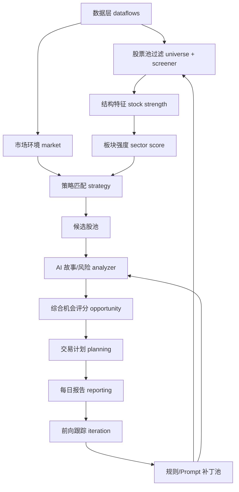

# AI 股票筛选系统技术方案 V1

> 依据：`docs/产品文档.md`、`docs/项目功能文档.md`、`docs/SYSTEM_DESIGN.md`、当前 `tradingagents/` 代码结构。
>
> 定位：在现有 Trading-Agent MVP 基础上，补齐产品 PRD 中“市场环境判断、机会评分、交易计划、日报、前向验证”的技术闭环。

## 1. 目标与边界

### 1.1 技术目标

V1 技术方案要支持每天盘后稳定产出：

1. 今日市场状态：攻击、正常、谨慎、防守。
2. 强板块排名：板块分、状态、成交额/宽度/持续性。
3. 候选股池：通过硬规则和结构特征的股票。
4. AI 逻辑分析：上涨逻辑、证据硬度、风险、过热、信息缺口。
5. 综合机会评分：S/A/B/C 等级和排序。
6. 交易计划：买入触发条件、止损、止盈、失效条件、仓位。
7. 每日报告：面向人工复核的 Markdown/JSON 产物。
8. 前向验证：跟踪候选未来收益、回撤、AI 评分有效性。

### 1.2 非目标

- 不自动下单。
- 不输出确定性买卖指令。
- 不承诺收益。
- 不在 V1 做完整量化回测平台。
- 不让 AI 绕过硬规则、风控和市场环境过滤。

### 1.3 核心原则

- 规则系统负责筛选，AI 负责解释和风险识别。
- 风控和仓位由确定性规则控制，不能被 AI 覆盖。
- 所有 AI 输出必须结构化、可追踪、可降级。
- 所有关键产物同时保留 JSON 和 Markdown。
- 每日结果必须可复盘，策略和 Prompt 修改必须经过补丁池。

## 2. 当前系统复用基础

当前项目已经具备以下能力，可以直接作为 V1 的基础：

| 能力 | 当前模块 | 说明 |
|---|---|---|
| A 股候选获取 | `tradingagents/dataflows/china/universe_provider.py` | 获取交易日股票池，支持主板、非 ST、涨幅阈值 |
| 结构特征补充 | `tradingagents/dataflows/china/batch_quotes_provider.py` | 补充 MA、量比、趋势、位置、突破等特征 |
| 粗筛规则 | `tradingagents/screener/coarse_rules.py` | 硬过滤和标签生成 |
| 板块校准 | `tradingagents/sector/sector_calibrator.py` | 行业强度、三日趋势、龙头状态、板块乘数 |
| 故事分析 | `tradingagents/analyzer/story_two_layer.py` | 新闻、基本面、概念、叙事、催化、故事卡 |
| AI 决策卡 | `tradingagents/analyzer/fine_filter_engine.py` | 标准化输出证据链、风险、反转条件等 |
| 日常流水线 | `tradingagents/pipelines/stock_analysis_pipeline.py` | A 候选、B 板块/故事、C 决策卡、主题热度 |
| 复盘迭代 | `tradingagents/pipelines/iteration_pipeline.py` | 三日跟踪、补丁建议、补丁池 |
| CLI 入口 | `cli/main.py` | `screen-analyze`、`daily-run`、`track-iterate`、`dashboard` |

## 3. 产品能力差距

| PRD 模块 | 当前状态 | V1 技术处理 |
|---|---|---|
| 股票池过滤 | 已有 MVP | 保留现有实现，补充流动性、上市时间、停牌等字段时做增强 |
| 市场环境判断 | 缺失独立模块 | 新增 `market` 评分模块，作为候选交易闸门 |
| 板块强度识别 | 有行业校准 MVP | 扩展为显式 `SectorScore`，输出板块分与状态 |
| 个股强度筛选 | 有结构特征和粗筛 | 扩展为显式 `StockStrengthScore` |
| 策略匹配 | 隐含在标签和 Prompt 中 | 新增策略匹配层，V1 先实现主线趋势策略 |
| AI 分析 | 已有 simple/two_layer 和决策卡 | 对齐 PRD 字段，增加 AI 分、风险分、过热分 |
| 综合机会评分 | 缺失统一评分 | 新增 `opportunity` 评分模块 |
| 交易计划 | 当前只有决策卡字段 | 新增 `planning` 模块生成条件式交易计划 |
| 每日报告 | 有分散 Markdown | 新增聚合日报 `R_daily_report.md/json` |
| 前向验证 | 有 3 日追踪 | 扩展到 1/5/10/20 日、按等级/策略/AI 分组统计 |

## 4. 目标架构



技术上不重写现有流水线，而是在 `stock_analysis_pipeline.py` 中插入四个新阶段：

```text
M: market environment
O: opportunity scoring
P: trade planning
R: daily report
```

目标产物目录：

```text
results/screener/<trade_date>/
├── M_market_environment.json/.md
├── A_candidates.json/.md
├── B_sector_calibration.json/.md
├── B_story_analysis.json/.md
├── C_ai_analysis_with_cards.json/.md
├── O_opportunity_scores.json/.md
├── P_trade_plans.json/.md
├── R_daily_report.json/.md
├── S_theme_heatmap.json/.md
└── Z_pipeline_trace_log.json/.md
```

## 5. 模块设计

### 5.1 市场环境模块

建议新增：

```text
tradingagents/market/
├── __init__.py
├── environment.py
└── schemas.py
```

输入：

- `trade_date`
- 主要指数行情。
- 全市场上涨/下跌家数。
- 全市场成交额。
- 涨停/跌停数量。
- 强势股后续反馈。

输出 `MarketEnvironment`：

| 字段 | 类型 | 说明 |
|---|---|---|
| trade_date | str | 交易日 |
| market_score | float | 0-100 |
| market_state | str | attack/normal/cautious/defensive |
| index_trend_score | float | 指数趋势得分 |
| breadth_score | float | 市场广度得分 |
| turnover_score | float | 成交额得分 |
| limit_sentiment_score | float | 涨跌停情绪得分 |
| risk_appetite_score | float | 风险偏好得分 |
| allowed_action | str | normal/light/observe_only/no_new_position |
| reasons | list[str] | 评分原因 |

评分公式按 PRD：

```text
市场分 =
指数趋势 * 30%
+ 市场广度 * 20%
+ 成交额状态 * 20%
+ 涨跌停情绪 * 20%
+ 风险偏好 * 10%
```

市场状态：

| 分数 | 状态 | 系统行为 |
|---|---|---|
| >= 75 | attack | 正常寻找交易机会 |
| 60-74 | normal | 可参与但控制仓位 |
| 45-59 | cautious | 只保留高质量机会 |
| < 45 | defensive | 不新增交易，只观察 |

### 5.2 板块强度模块

当前 `sector_calibrator.py` 可以继续承担板块上下文计算，但需要扩展显式评分。

输出 `SectorScore`：

| 字段 | 类型 | 说明 |
|---|---|---|
| sector | str | 板块/行业 |
| sector_score | float | 0-100 |
| sector_state | str | mainline/strong/watch/weak |
| short_term_return_score | float | 1/3/5 日涨幅 |
| relative_strength_score | float | 相对大盘强度 |
| turnover_expansion_score | float | 成交额放大 |
| breadth_score | float | 板块宽度 |
| limit_up_score | float | 涨停数量 |
| persistence_score | float | 持续性 |
| leader_symbol | str | 龙头代码 |
| leader_status | str | 强/分歧/退潮 |

V1 可以先用行业字段聚合，后续再引入东财概念、申万行业或自定义题材图谱。

### 5.3 个股强度模块

当前 `attach_struct_features` 已产出趋势、位置、量能、突破等字段。V1 需要在此基础上形成统一 `StockStrengthScore`：

| 字段 | 类型 | 说明 |
|---|---|---|
| symbol | str | 股票代码 |
| stock_strength_score | float | 个股强度分 |
| trend_score | float | 趋势结构 |
| relative_strength_score | float | 相对指数/板块强度 |
| volume_score | float | 成交额变化 |
| high_distance_score | float | 距离新高 |
| drawdown_score | float | 回撤控制 |
| liquidity_score | float | 流动性 |
| overheat_flag | bool | 是否短期过热 |

评分公式按 PRD：

```text
个股强度 =
趋势结构 * 25%
+ 相对强度 * 20%
+ 成交额变化 * 20%
+ 距离新高 * 15%
+ 回撤控制 * 10%
+ 流动性 * 10%
```

### 5.4 策略匹配模块

建议新增：

```text
tradingagents/strategy/
├── __init__.py
├── matcher.py
└── schemas.py
```

V1 只落地主线趋势策略，保留扩展点：

| 策略 | V1 状态 | 触发条件 |
|---|---|---|
| 主线趋势策略 | 实现 | 市场不弱 + 板块强 + 个股趋势转强 + 放量 + 相对强 |
| 商品价格驱动 | 预留 | 商品价格数据 + 相关板块 + 公司暴露 |
| 事件催化 | 预留 | 结构化公告/新闻 + 个股量价确认 |
| 业绩反转 | 预留 | 财报/业绩预告 + 趋势改善 |
| 情绪强势 | 预留 | 涨停/连板/短线情绪 |

输出 `StrategyMatch`：

| 字段 | 类型 | 说明 |
|---|---|---|
| symbol | str | 股票代码 |
| strategy_type | str | mainline_trend 等 |
| strategy_score | float | 策略匹配分 |
| matched_rules | list[str] | 命中规则 |
| failed_rules | list[str] | 未满足规则 |
| strategy_note | str | 解释文本 |

### 5.5 AI 分析模块

保留当前两条路径：

- simple：快速跑批，关键词和热度统计。
- two_layer：重点标的，叙事、催化、故事卡、证据硬度。

需要把 AI 输出统一映射为 `AIAnalysisScore`：

| 字段 | 类型 | 说明 |
|---|---|---|
| symbol | str | 股票代码 |
| catalyst_type | str | 商品/政策/业绩/订单/资金博弈等 |
| catalyst_authenticity_score | float | 受益真实性 |
| catalyst_strength_score | float | 催化强度 |
| sustainability_score | float | 持续性 |
| risk_score | float | 风险分，越高越危险 |
| overheat_score | float | 过热分，越高越过热 |
| sector_position | str | 龙头/中军/补涨/跟风 |
| evidence_hardness | str | Strong/Medium/Weak |
| data_gaps | list[str] | 信息缺口 |
| ai_conclusion | str | plan/watch/drop |

AI 调用约束：

- 必须输出 JSON。
- 必须区分 HARD 和 INFERRED。
- 必须引用证据或说明缺口。
- 禁止输出“必涨”“确定买入”等确定性表述。
- JSON 解析失败时使用 fallback。

### 5.6 综合机会评分模块

建议新增：

```text
tradingagents/opportunity/
├── __init__.py
├── scorer.py
└── schemas.py
```

输入：

- `MarketEnvironment`
- `SectorScore`
- `StockStrengthScore`
- `StrategyMatch`
- `AIAnalysisScore`
- 买点质量评估

输出 `OpportunityScore`：

| 字段 | 类型 | 说明 |
|---|---|---|
| symbol | str | 股票代码 |
| total_score | float | 机会总分 |
| grade | str | S/A/B/C |
| market_score_component | float | 市场分贡献 |
| sector_score_component | float | 板块分贡献 |
| stock_score_component | float | 个股分贡献 |
| structure_score_component | float | 量价结构贡献 |
| strategy_score_component | float | 策略贡献 |
| ai_score_component | float | AI 催化真实性贡献 |
| entry_quality_component | float | 买点质量贡献 |
| risk_penalty | float | 风险惩罚 |
| rank_reason | str | 排名原因 |

评分公式：

```text
最终机会分 =
市场环境 10%
+ 板块强度 20%
+ 个股强度 20%
+ 量价结构 15%
+ 策略匹配 10%
+ AI 催化真实性 10%
+ 买点质量 10%
- 风险惩罚 15%
```

等级：

| 等级 | 分数 | 动作 |
|---|---|---|
| S | >= 85 | 生成完整交易计划 |
| A | 75-84 | 重点观察，等待买点 |
| B | 65-74 | 普通观察 |
| C | < 65 | 剔除或低优先级 |

### 5.7 交易计划模块

建议新增：

```text
tradingagents/planning/
├── __init__.py
├── trade_plan.py
└── schemas.py
```

输出 `TradePlan`：

| 字段 | 类型 | 说明 |
|---|---|---|
| symbol | str | 股票代码 |
| name | str | 股票名称 |
| strategy_type | str | 所属策略 |
| grade | str | 机会等级 |
| entry_conditions | list[str] | 买入触发条件 |
| stop_loss_conditions | list[str] | 止损条件 |
| take_profit_rules | list[str] | 止盈/保护利润 |
| invalidation_conditions | list[str] | 逻辑失效条件 |
| max_position_pct | float | 最大仓位 |
| holding_period | str | 预期持仓周期 |
| watch_variables | list[str] | 关注变量 |
| plan_status | str | active/watch/blocked |

仓位规则：

| 市场状态 | 单票上限 | 组合行为 |
|---|---:|---|
| attack | 10%-15% | 可正常选择 S/A |
| normal | 5%-10% | 优先 S，精选 A |
| cautious | 3%-5% | 只保留 S 或高质量 A |
| defensive | 0% | 不新增，只观察 |

计划文案必须保持条件式：

```text
当 A、B、C 同时满足时，进入观察/可考虑执行；
若 X、Y、Z 触发，则放弃或退出。
```

### 5.8 每日报告模块

建议新增：

```text
tradingagents/reporting/
├── __init__.py
├── daily_report.py
└── schemas.py
```

输出：

- `R_daily_report.json`
- `R_daily_report.md`

报告结构：

1. 今日市场状态。
2. 最强板块排名。
3. 候选股总览。
4. S 级机会。
5. A 级观察。
6. AI 分析摘要。
7. 明日交易计划。
8. 重点风险。
9. 明日观察清单。

Markdown 面向人工阅读，JSON 面向 Dashboard、Web UI、复盘系统复用。

### 5.9 前向验证模块

当前 `iteration_pipeline.py` 已支持 3 日追踪。V1 应扩展为多周期验证：

| 指标 | 说明 |
|---|---|
| future_1d_return_pct | 未来 1 日收益 |
| future_5d_return_pct | 未来 5 日收益 |
| future_10d_return_pct | 未来 10 日收益 |
| future_20d_return_pct | 未来 20 日收益 |
| max_gain_pct | 未来最大涨幅 |
| max_drawdown_pct | 未来最大回撤 |
| beat_index | 是否跑赢指数 |
| beat_sector | 是否跑赢板块 |

分组统计：

- 按 S/A/B/C 等级。
- 按策略类型。
- 按 AI 高/中/低分。
- 按风险高/中/低。
- 按过热判断。
- 按板块状态。

补丁池继续沿用当前状态流转：

```text
proposed -> accepted -> applied
proposed -> rejected
```

## 6. CLI 与配置设计

### 6.1 CLI 保持兼容

现有命令保持不变：

```bash
tradingagents screen-analyze
tradingagents daily-run
tradingagents track-iterate
tradingagents dashboard
tradingagents interactive
```

建议新增参数：

| 参数 | 命令 | 说明 |
|---|---|---|
| `--market-gate/--no-market-gate` | screen-analyze/daily-run | 是否启用市场环境交易闸门 |
| `--plan-mode` | screen-analyze/daily-run | `none/basic/full` |
| `--min-grade` | screen-analyze/daily-run | 只输出指定等级以上交易计划 |
| `--report-format` | daily-run | `md/json/all` |
| `--review-horizon` | track-iterate | `3,5,10,20` |

### 6.2 配置结构

在 `DEFAULT_CONFIG["stock_analysis"]` 中扩展：

```python
"market_environment": {
    "enabled": True,
    "defensive_blocks_new_positions": True,
},
"opportunity_scoring": {
    "enabled": True,
    "min_plan_grade": "A",
},
"trade_planning": {
    "enabled": True,
    "default_holding_period": "3-10 trading days",
    "max_single_position_pct": 0.15,
},
"daily_report": {
    "enabled": True,
    "formats": ["json", "md"],
}
```

## 7. 数据与持久化

### 7.1 产物存储

继续使用本地文件：

```text
results/
├── screener/<trade_date>/
└── iteration/<trade_date>/
```

原因：

- 当前系统已按此模式运行。
- 便于人工审阅、版本对比、问题排查。
- 后续迁移数据库时，JSON 产物可以直接作为导入源。

### 7.2 后续数据库演进

若要做 Web UI 或多人协作，建议引入 SQLite/PostgreSQL：

| 表 | 用途 |
|---|---|
| `daily_runs` | 每次运行元数据 |
| `market_environments` | 市场状态 |
| `sector_scores` | 板块评分 |
| `candidates` | 候选股 |
| `ai_analyses` | AI 结构化结论 |
| `opportunity_scores` | 综合评分 |
| `trade_plans` | 交易计划 |
| `forward_metrics` | 前向验证指标 |
| `patch_proposals` | 补丁池 |

V1 不强制上数据库，避免增加落地复杂度。

## 8. 错误处理与降级

| 场景 | 处理 |
|---|---|
| 数据源失败 | 记录到 trace log，使用可用字段继续，关键字段缺失则跳过对应股票 |
| LLM 调用失败 | fallback 决策卡，标记 `analysis_trace.mode=fallback` |
| LLM JSON 解析失败 | 保存 raw output，生成 fallback，写入 `info_gaps` |
| 市场环境数据不足 | 输出 `market_state=unknown`，不强行启用交易闸门 |
| 板块字段缺失 | 归入 `unknown_sector`，降低板块分 |
| 风险分过高 | 降级机会等级或阻止生成 active plan |

## 9. 测试方案

### 9.1 单元测试

重点覆盖：

- 市场环境评分。
- 板块评分。
- 个股强度评分。
- 策略匹配。
- 综合机会评分。
- 交易计划仓位规则。
- AI 输出 schema 校验。

### 9.2 集成测试

使用固定 fixture，模拟完整盘后流程：

```text
fixture universe
-> attach_struct_features
-> coarse_screen
-> market_environment
-> sector_score
-> story/fallback
-> opportunity_score
-> trade_plan
-> daily_report
```

断言：

- 所有 JSON 产物存在。
- 所有必填字段存在。
- S/A/B/C 分级稳定。
- defensive 市场不会生成新增仓位计划。
- AI 失败时仍有 fallback 输出。

### 9.3 回归测试

对 `results/screener/<fixture_date>/` 做快照测试，避免字段变更破坏 Dashboard 和复盘系统。

## 10. 分阶段落地计划

### P0：契约稳定

- 定义 `MarketEnvironment`、`SectorScore`、`StockStrengthScore`、`StrategyMatch`、`AIAnalysisScore`、`OpportunityScore`、`TradePlan` schema。
- 为现有 A/B/C 产物补字段映射，不改变现有命令行为。
- 增加 schema 校验和 fixture 测试。

### P1：市场环境与机会评分

- 新增 `market` 模块。
- 扩展 `sector` 显式板块分。
- 新增 `opportunity` 模块。
- 输出 `M_market_environment` 和 `O_opportunity_scores`。

### P2：交易计划与日报

- 新增 `planning` 模块。
- 新增 `reporting` 模块。
- 输出 `P_trade_plans` 和 `R_daily_report`。
- `daily-run` 默认生成完整日报。

### P3：前向验证增强

- 将 3 日追踪扩展到 1/5/10/20 日。
- 增加按等级、策略、AI 分、风险分的分组统计。
- 让补丁建议引用更明确的分组证据。

### P4：产品化界面

- 先增强 CLI Dashboard。
- 再考虑 Web UI：按日期、股票、板块、等级检索历史结果。
- 增加观察名单和人工打标。

## 11. V1 验收标准

V1 完成后，运行：

```bash
tradingagents daily-run --story-mode simple
```

应稳定生成：

1. `M_market_environment.json/.md`
2. `A_candidates.json/.md`
3. `B_sector_calibration.json/.md`
4. `B_story_analysis.json/.md`
5. `C_ai_analysis_with_cards.json/.md`
6. `O_opportunity_scores.json/.md`
7. `P_trade_plans.json/.md`
8. `R_daily_report.json/.md`
9. `Z_pipeline_trace_log.json/.md`

人工打开 `R_daily_report.md` 后，应能直接回答：

1. 今天能不能做？
2. 当前最强板块是什么？
3. 明天重点看哪些股票？
4. 每只重点股票触发什么条件才行动？
5. 错了在哪里退出？
6. 哪些风险会让计划失效？

## 12. 结论

当前项目已经完成了“候选发现、板块校准、故事分析、AI 决策卡、三日复盘”的 MVP 主链路。V1 的技术重点不是推倒重写，而是在现有 A/B/C 流水线后补齐四个产品化层：

```text
市场环境 M -> 综合评分 O -> 交易计划 P -> 每日报告 R
```

这样可以最小改动地把系统从“能筛选和分析”推进到“能每天稳定输出可执行观察计划，并能持续验证和迭代”。

## 13. Skills 审视补充

本节基于 `zoom-out` 和 `improve-codebase-architecture` 两个现有技能补充。`zoom-out` 用来从项目整体视角梳理主链路，`improve-codebase-architecture` 用来识别哪些模块需要变深，避免 V1 新增能力继续堆在流水线函数里。

### 13.1 全局模块地图

当前仓库围绕两条主链路组织：

```text
日常筛选链路:
dataflows -> screener -> sector -> analyzer/story -> analyzer/fine_filter -> results/screener

复盘迭代链路:
results/screener -> iteration/tracker -> iteration/review_engine -> iteration/patch_pool -> results/iteration
```

面向 V1 产品目标，应把链路提升为：

```text
候选发现 -> 市场过滤 -> 板块语境 -> 个股解释 -> 机会分级 -> 交易计划 -> 日报 -> 前向验证 -> 补丁池
```

对应模块地图：

| 产品概念 | 现有模块 | V1 深化模块 |
|---|---|---|
| 候选发现 | `dataflows/china/*`、`screener/coarse_rules.py` | `screener` 保持硬规则入口 |
| 市场过滤 | 暂缺 | 新增 `market` |
| 板块语境 | `sector/sector_calibrator.py` | 扩展 `sector` 成显式评分模块 |
| 个股解释 | `analyzer/story_two_layer.py`、`fine_filter_engine.py` | 保留 AI 解释，新增评分适配 |
| 机会分级 | 暂缺 | 新增 `opportunity` |
| 交易计划 | 决策卡文本中隐含 | 新增 `planning` |
| 日报 | 分散 Markdown | 新增 `reporting` |
| 前向验证 | `iteration/tracker.py` | 扩展多周期和分组统计 |
| 补丁池 | `iteration/patch_pool.py` | 保持人工审核入口 |

### 13.2 架构深挖机会

#### 机会 1：把 `stock_analysis_pipeline` 从胖编排模块拆成产物编排模块

**Files**

- `tradingagents/pipelines/stock_analysis_pipeline.py`
- 未来 `tradingagents/reporting/*`

**Problem**

当前流水线模块同时负责数据编排、结果构造、Markdown 渲染、trace log 组装、目录写入和单票卡片落盘。这个 Module 的 Interface 看起来只有 `run_stock_analysis_pipeline`，但调用者需要间接理解大量产物字段和输出约定；新增 M/O/P/R 阶段时，Implementation 会继续膨胀。

**Solution**

保留 `run_stock_analysis_pipeline` 作为外部 Interface，但把内部拆成更深的 Module：

- `pipeline_steps`：只负责运行阶段并返回结构化结果。
- `reporting`：负责 Markdown/JSON 渲染。
- `artifact_writer`：负责文件命名、目录、写入。
- `trace_builder`：负责 trace log。

**Benefits**

Locality 会提升：产物格式变更集中在 `reporting`，文件布局变更集中在 `artifact_writer`。测试也可以直接穿过这些 Module 的 Interface，而不是每次跑完整数据源和 LLM。

#### 机会 2：把评分从候选字典中分离为显式契约

**Files**

- `tradingagents/dataflows/china/batch_quotes_provider.py`
- `tradingagents/screener/coarse_rules.py`
- 未来 `tradingagents/opportunity/schemas.py`

**Problem**

当前候选在多个阶段以 `Dict` 传递，字段来自行情、结构特征、板块校准、故事分析和 AI 决策卡。这个 Interface 隐含在文档和调用顺序中，新增评分和交易计划时容易出现字段缺失、语义重复或同名不同义。

**Solution**

定义显式数据契约：

- `CandidateRecord`
- `StockStrengthScore`
- `SectorScore`
- `AIAnalysisScore`
- `OpportunityScore`
- `TradePlan`

前期可以用 Pydantic schema 校验，不强制一次性改掉所有字典传递。

**Benefits**

Leverage 会提升：机会评分、日报、复盘统计可以复用同一套 Interface。测试面也更小，只要构造 schema fixture 即可验证评分和计划逻辑。

#### 机会 3：把板块校准升级为板块评分 Module

**Files**

- `tradingagents/sector/sector_calibrator.py`

**Problem**

当前板块模块输出行业均值、三日趋势、龙头状态和乘数，适合给 AI 决策卡提供语境，但还不能直接回答 PRD 中“当前最强板块是什么、板块是否强主线、板块是否退潮”。它的 Interface 对产品层还不够深。

**Solution**

在 `sector` 内新增 `score_sectors`，输出 `SectorScore` 和 `sector_rankings`。`calibrate_with_sector` 可以继续保留，用 `SectorScore` 回填个股字段。

**Benefits**

一个 Module 同时服务日报、机会评分、交易计划和复盘分组。板块口径未来从行业切换到概念/申万行业时，调用者不需要改。

#### 机会 4：把交易计划做成确定性 Module，而不是 Prompt 文案

**Files**

- `tradingagents/analyzer/fine_filter_engine.py`
- 未来 `tradingagents/planning/trade_plan.py`

**Problem**

当前 AI 决策卡已有可交易性、最大风险和反转触发条件，但还没有结构化买点、止损、仓位、失效条件。若这些字段直接交给 LLM 生成，会削弱风控 Locality，并让防守市场仓位约束难以测试。

**Solution**

`planning` Module 以 `OpportunityScore`、`MarketEnvironment`、`DecisionCard` 为输入，确定性生成 `TradePlan`。AI 只提供解释和风险素材，不直接决定仓位。

**Benefits**

风控规则集中、可测试、可复盘。防守市场不新增仓位、风险高则降级等规则可以单元测试覆盖。

#### 机会 5：把前向验证从三日跟踪扩展为分组评估 Module

**Files**

- `tradingagents/iteration/tracker.py`
- `tradingagents/iteration/review_engine.py`

**Problem**

当前跟踪以 T+1/T+2/T+3 为核心，适合短线样本观察，但还不能验证 S/A/B 分级、AI 风险评分、策略类型和交易计划触发条件是否有效。

**Solution**

新增 `forward_metrics` 和 `group_evaluator`：

- 多周期收益：1/5/10/20 日。
- 最大涨幅和最大回撤。
- 按等级、策略、AI 风险、过热、板块状态分组。
- 补丁建议必须引用分组证据。

**Benefits**

补丁池不再只基于单样本回撤，而能基于稳定分组表现提出建议。策略优化更接近产品 PRD 的“前向验证 AI”。

### 13.3 第一批实施切片

建议按以下顺序实施，保证每一步都能单独合并和验证：

| 切片 | 目标 | 改动范围 | 验收 |
|---|---|---|---|
| Slice 1 | 建立 schema 契约 | 新增 `market/schemas.py`、`opportunity/schemas.py`、`planning/schemas.py` | 单元测试能构造并校验核心对象 |
| Slice 2 | 市场环境 MVP | 新增 `market/environment.py`，先用可获得数据计算市场状态 | 生成 `M_market_environment.json/.md` |
| Slice 3 | 板块评分 | 扩展 `sector` 输出 `sector_score`、`sector_state` | `B_sector_calibration.json` 兼容旧字段并新增评分 |
| Slice 4 | 机会评分 | 新增 `opportunity/scorer.py` | 生成 `O_opportunity_scores.json/.md`，S/A/B/C 稳定 |
| Slice 5 | 交易计划 | 新增 `planning/trade_plan.py` | 防守市场仓位为 0，S/A 有条件式计划 |
| Slice 6 | 每日报告 | 新增 `reporting/daily_report.py` | 生成 `R_daily_report.md/json` |
| Slice 7 | 复盘增强 | 扩展 `iteration` 分组统计 | 能按等级和策略输出表现摘要 |

### 13.4 P0 文件结构建议

```text
tradingagents/
├── market/
│   ├── __init__.py
│   ├── environment.py
│   └── schemas.py
├── opportunity/
│   ├── __init__.py
│   ├── scorer.py
│   └── schemas.py
├── planning/
│   ├── __init__.py
│   ├── trade_plan.py
│   └── schemas.py
├── reporting/
│   ├── __init__.py
│   ├── daily_report.py
│   └── artifact_writer.py
└── pipelines/
    └── stock_analysis_pipeline.py
```

### 13.5 关键设计约束

- `run_stock_analysis_pipeline` 继续作为外部 Interface，避免破坏 CLI。
- 新阶段只追加产物，不删除旧产物，保证 Dashboard 和复盘系统兼容。
- 评分和交易计划必须可在 `enable_ai=False` 时运行。
- AI 失败时不得阻断日报生成。
- 防守市场下，交易计划只能是观察或阻塞，不能给新增仓位。
- 交易计划只输出条件式计划，不输出确定性买卖建议。

### 13.6 需要暂缓的架构动作

以下动作暂缓，不放入 P0/P1：

- 一次性把所有 `Dict` 改成 Pydantic 对象。
- 引入数据库替代 `results/` 文件产物。
- 把 CLI 改成 Web UI。
- 抽象多数据源市场环境 Adapter，除非出现第二个可用市场环境数据源。
- 重写现有两层故事分析 Prompt。

这些动作都可能有价值，但不在当前最短产品闭环上。
